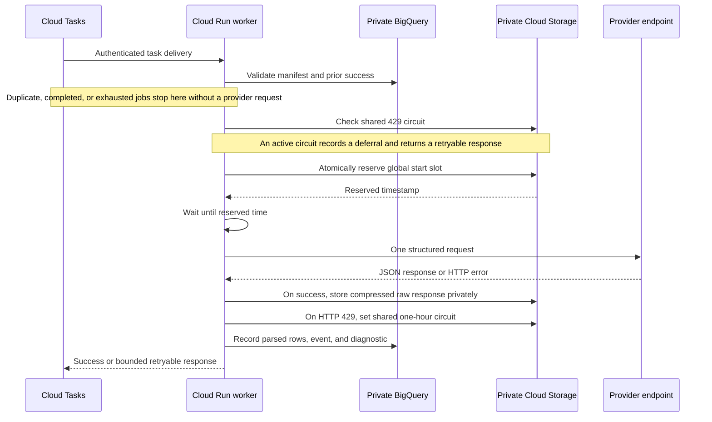

# Responsible Data Collection

## 1. Purpose And Scope

This document explains how the Delivery Availability Pipeline limits traffic, distributes work, responds to upstream signals, and records evidence about each collection. It describes safeguards implemented in the software; it is not a blanket claim that every possible deployment is lawful, ethical, or permitted by a platform.

Before starting a collection, the operator remains responsible for reviewing the provider's current terms, robots guidance, endpoint behaviour, institutional approval, research purpose, data-protection obligations, and expected load.

The design objective is simple:

> A large cloud task backlog must never become an uncontrolled burst of upstream requests.

## 2. Threat Model

The pipeline assumes that cloud execution is variable. Tasks can arrive close together, Cloud Run can start several instances, workers can experience different latencies, and Cloud Tasks can retry failed deliveries. Limiting only the number of tasks created, or only the average queue rate, is therefore insufficient.

The design addresses five specific risks:

1. **Bulk scheduling risk:** tens of thousands of postcodes could otherwise become eligible at once.
2. **Dispatch jitter:** a nominal queue rate is an average control and does not prove exact spacing between upstream request starts.
3. **Horizontal scaling:** several Cloud Run instances can execute simultaneously.
4. **Variable processing time:** authentication, cold starts, BigQuery work, storage work, and network latency can cause workers to reach the provider at different times.
5. **Retries and provider feedback:** failed task delivery can be retried, while an HTTP 429 may indicate that further traffic should stop rather than retry immediately.

## 3. Layered Control Model

No single component is treated as sufficient. Four independent layers reduce traffic risk before a provider request is made.

| Layer | Control | Primary purpose |
| --- | --- | --- |
| 1 | Bounded inputs and explicit time windows | Prevent an unbounded or accidental collection |
| 2 | Cloud Tasks scheduling and queue limits | Pace delivery to workers and cap worker concurrency |
| 3 | Shared global request-start lock | Enforce spacing across all worker instances despite jitter |
| 4 | Shared HTTP 429 circuit breaker | Stop new provider requests after an explicit rate-limit signal |

## 4. Layer 1: Bounded Work And Window Distribution

### 4.1 Known input size

Every run begins with a finite postcode input. The task creator reports the number of postcodes, selected observation tags, run identifier, and generated task count before work is sent to Cloud Tasks.

### 4.2 Explicit collection windows

Tasks are assigned to explicit local-time intervals. A window configuration defines when a task is eligible, rather than relying on workers to consume one undifferentiated backlog as quickly as possible.

### 4.3 Capacity shards, not repeated observations

When one observation tag has several eligible dates, those intervals are capacity shards. Each postcode is assigned once for that tag. The system does not silently turn four dates into four national observations.

### 4.4 Deterministic and resumable task identities

Job and task identifiers are deterministic. Re-running task creation can skip already-created or already-recorded work instead of duplicating provider requests. A worker also checks whether a successful event already exists before making another request.

### 4.5 Fast task creation does not mean fast scraping

The task creator may upload tasks with several local threads so it can keep up with Cloud Tasks administration. This concurrency affects only task insertion into Google Cloud. It does not bypass `scheduled_at`, queue limits, the worker limiter, or the 429 circuit.

## 5. Layer 2: Cloud Tasks Distribution

Cloud Tasks is the durable workload distributor. It stores the backlog, releases tasks near their scheduled times, authenticates calls to the worker, and retries failed task delivery according to a bounded policy.

The established postcode configuration uses:

- maximum dispatch rate: `1 task/second`;
- maximum concurrent dispatches: `4`;
- maximum attempts: `3`;
- minimum retry backoff: `30 seconds`; and
- maximum retry backoff: `10 minutes`.

These values have separate meanings:

- **Dispatch rate** limits how quickly Cloud Tasks sends HTTP requests to the worker.
- **Concurrency** limits how many task requests can be active at the worker at once.
- **Backoff** prevents an immediate tight retry loop after a worker failure.
- **Scheduled time** spreads the national workload across the intended research windows.

Cloud Tasks is not treated as the final API rate limiter. A task may spend different amounts of time in worker startup, validation, BigQuery checks, or storage operations before it reaches the provider. Multiple workers can therefore approach the upstream request point close together even when task dispatch looked regular.

## 6. Layer 3: The Global Request-Start Hard Lock

### 6.1 Why the hard lock exists

The global limiter controls the event that matters to the upstream service: **the start time of each provider request**. It operates after task validation and immediately before the API call.

Without this layer, four concurrently dispatched tasks could experience different cold-start and database delays, then converge and start their provider requests almost simultaneously. The global lock absorbs that timing variation.

### 6.2 Shared across every worker instance

The limiter state is stored in private Cloud Storage rather than process memory. All Cloud Run containers using the same limiter key therefore participate in one global sequence.

The implementation uses two private objects:

- a short-lived lock object used to serialise slot reservation; and
- a state object containing the last reserved API start time and configured spacing.

The lock is acquired with a Cloud Storage generation precondition. Only one worker can create the lock object for the current generation; competing workers wait and try again. A lock older than two minutes can be reclaimed so that an interrupted worker does not block the pipeline indefinitely.

### 6.3 Reservation formula

While holding the lock, a worker calculates its request-start slot as:

```text
reserved_start = max(
    current_time + start_guard,
    previous_reserved_start + spacing
)
```

For the established postcode configuration:

- `spacing = 1300 ms`; and
- `start_guard = 1000 ms`.

The worker writes the new reserved start to shared state, releases the short-lived lock, sleeps until its assigned time, and only then starts the provider request.

### 6.4 Example with four concurrent workers

Assume four workers reach the limiter at nearly the same moment. Their request starts are reserved centrally rather than determined by container timing:

```text
Worker A  | reserve | wait | request start at T + 1.0s
Worker B  | reserve |----------- wait -----------| request start at T + 2.3s
Worker C  | reserve |---------------------- wait ----------------------| request start at T + 3.6s
Worker D  | reserve |--------------------------------- wait ---------------------------------| request start at T + 4.9s
```

This remains true when workers are on different Cloud Run instances. A slow worker cannot cause another worker to take the same slot because each reservation advances the shared timestamp before the lock is released.

### 6.5 What the hard lock does and does not guarantee

The hard lock guarantees minimum spacing between **reserved request starts** for workers sharing a limiter key. It does not wait for one response to finish before the next request starts. If an upstream request is unusually slow, more than one request may be in flight; Cloud Tasks concurrency provides a separate upper bound on that overlap.

This is a reservation-based distributed lock, not a mathematical guarantee about the operating system's eventual execution time. A worker releases the short-lived lock and sleeps until its slot. An unusual process suspension after reservation could delay the real request start, so deployments must verify `api_request_started_at` gaps rather than assuming reserved timestamps are sufficient. A stronger formal guarantee would require a single request dispatcher or serialising the request initiation itself, with a corresponding throughput and availability trade-off.

This distinction is intentional:

- the global lock controls burst timing;
- queue concurrency bounds overlapping slow requests; and
- the 429 circuit responds to explicit provider feedback.

## 7. Layer 4: Shared HTTP 429 Circuit Breaker

Before reserving a rate token, each worker checks a shared ban-state object in private Cloud Storage.

If the circuit is active:

1. the worker does not call the provider;
2. it records a `deferred_ban_active` diagnostic;
3. it appends a deferred event; and
4. it returns a retryable service response so Cloud Tasks can deliver the job later.

If the provider returns HTTP 429, the worker writes a shared ban-until timestamp. The established configuration uses `3600 seconds`, based on observed one-hour blocking behaviour during controlled testing.

The circuit is checked before each new request, but it cannot retroactively cancel requests that were already in flight when the first 429 was received. This is another reason to keep queue concurrency bounded.

## 8. Request Lifecycle



## 9. Idempotency And Retry Containment

The pipeline contains several protections against duplicate collection:

- deterministic Cloud Task names make duplicate creation return `AlreadyExists`;
- deterministic job identifiers allow task creation to resume;
- `--skip-existing` excludes postcodes already recorded for a run and window;
- a worker returns without calling the provider when a success event already exists; and
- a manifest-level maximum-attempt count prevents unlimited provider attempts.

The API client itself performs one request and does not contain an aggressive immediate retry loop. Cloud Tasks handles bounded retries outside the worker, where they remain subject to the circuit breaker and global limiter.

## 10. Endpoint Isolation

The postcode listing API and menu-manifest CDN are different upstream surfaces. They use separate limiter keys and should be monitored separately.

A bounded menu-manifest test supported a `1000 ms` start spacing for that CDN. This result does not justify reducing the postcode API spacing or combining both traffic streams under an assumption that their limits are identical.

## 11. Monitoring And Audit Evidence

Every provider attempt writes millisecond-level diagnostics where possible.

| Evidence | Purpose |
| --- | --- |
| `worker_received_at` and `worker_started_at` | Separate queue delivery time from worker processing time |
| `limiter_acquire_started_at` and `limiter_acquire_finished_at` | Measure lock contention |
| `limiter_attempts` | Identify competing workers or stale-lock pressure |
| `limiter_spacing_ms` | Record the configured hard-lock interval |
| `limiter_previous_next_allowed_ms` | Reconstruct the prior shared reservation |
| `limiter_token_reserved_for_ms` | Identify the exact assigned request-start slot |
| `limiter_wait_ms` | Measure how much jitter the hard lock absorbed |
| `api_request_started_at` and `api_request_finished_at` | Verify actual request timing |
| `api_latency_ms` | Identify slow upstream responses and overlapping-request risk |
| `http_status` and `outcome` | Detect refusal, overload, failure, and success |
| `raw_uri` and `processed_rows` | Link provenance without publishing raw content |

Run monitoring should inspect:

- minimum and percentile gaps between API request starts;
- HTTP 403, 429, and 5xx counts;
- success, failure, deferred, and duplicate-skip counts;
- queue depth and oldest-task age;
- tasks completed outside their intended collection interval;
- limiter wait distributions and lock attempts; and
- the number of requests simultaneously in flight.

## 12. Test-To-Production Process

1. Develop and test parsing against saved or synthetic fixtures where possible.
2. Use a tiny local live probe only when a fresh response is necessary.
3. Run a bounded cloud sample in an isolated queue, table suffix, run id, and limiter key.
4. Inspect request-start gaps, HTTP outcomes, latency, output schema, and window timing.
5. Increase sample size only after the previous stage is stable.
6. Authorise a bounded full run with explicit input size, windows, rate, concurrency, spacing, and expected duration.
7. Monitor the run while active; stop or defer it when provider signals or timing evidence indicate elevated risk.

Automated tests and pull requests must not generate live provider traffic.

## 13. Data Minimisation And Privacy

The project targets business listings and service availability. It does not seek user accounts, customer identities, orders, payment information, or authentication material.

Complete source responses are retained privately only to support validation and controlled reprocessing. Analytical tables select fields needed for the research design. Raw responses, logs, diagnostics, exports, credentials, and live cloud configuration are excluded from the public repository.

Requests use a descriptive research User-Agent containing the public repository URL. No personal email address is embedded in the software.

## 14. Limitations

- A public endpoint can change, introduce authentication, or be withdrawn without notice.
- Historical success at a given rate does not guarantee that rate remains acceptable.
- A request-start limiter does not eliminate all overlapping in-flight requests.
- Reserved start slots can be delayed by process scheduling, so actual request-start gaps must be monitored.
- The 429 circuit cannot cancel requests already in flight.
- HTTP 403, empty results, and temporary offline states can have several meanings.
- Platform delivery and opening states are observations, not contractual facts.
- The software's MIT licence does not grant rights to third-party content.

## 15. External Guidance

The responsible-collection design was informed by the general principles in the [Office for National Statistics Web Scraping Policy](https://www.ons.gov.uk/aboutus/transparencyandgovernance/datastrategy/datapolicies/webscrapingpolicy). In particular, the project reflects the policy's emphasis on minimising burden on website operators, respecting applicable access restrictions, maintaining transparency, and reviewing legal and ethical considerations.

These principles are reflected in the pipeline through bounded collection inputs, explicit time windows, Cloud Tasks pacing, a shared global request-start lock, a one-hour circuit breaker after HTTP 429 responses, auditable request diagnostics, and private handling of raw responses and derived research data.

The ONS policy is written for ONS activities and states that its scope does not cover APIs. This project therefore cites it as influential guidance rather than claiming formal compliance with, certification by, or endorsement from the ONS.
